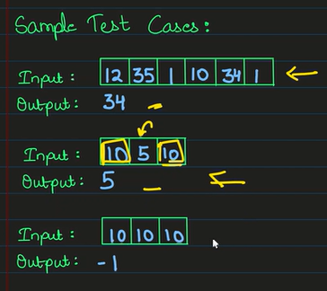
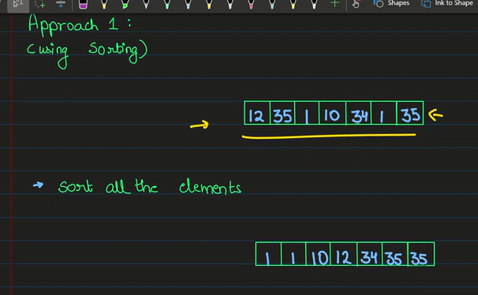
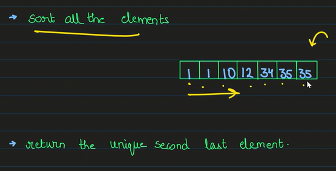
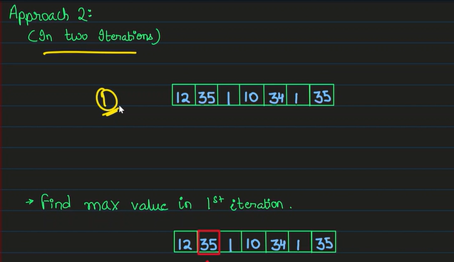
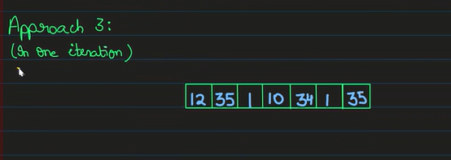
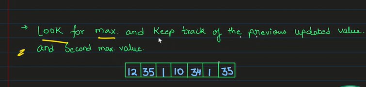
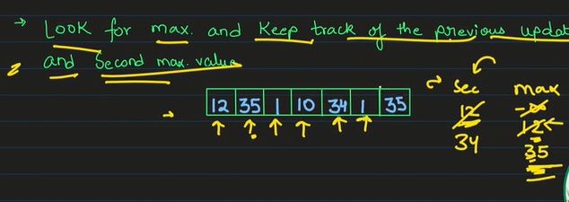
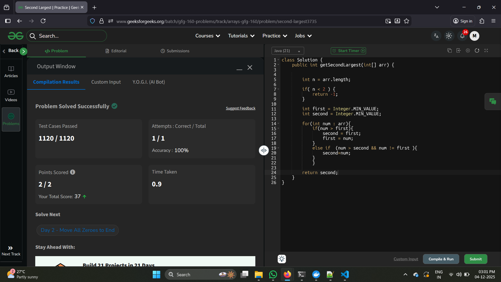

## Second Largest Element



--- 

 Approach

1. Sorting
   
   ```Brute Force```

   

   

---


Complexity Analysis :

- T.C : O(n log n) 
- S.C : O(1)

---
2. In two iterations

   

   

Complexity Analysis 

T.C : O(2n)
S.C : O(1) 

---

3. In single iteration 

   

   

   

Complexity Analysis :

- T.C : O(n)
- S.C : O(1)

## Solution 

``` bash
https://www.geeksforgeeks.org/batch/gfg-160-problems/track/arrays-gfg-160/problem/second-largest3735
```

