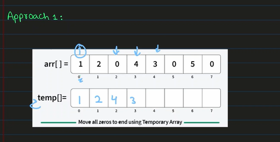
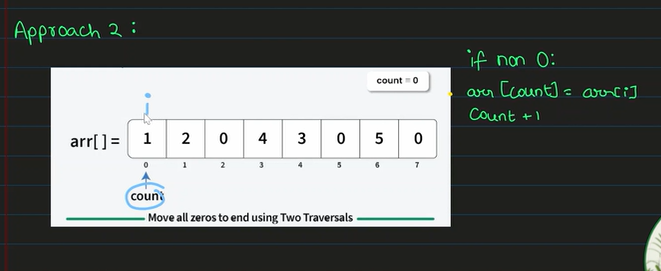
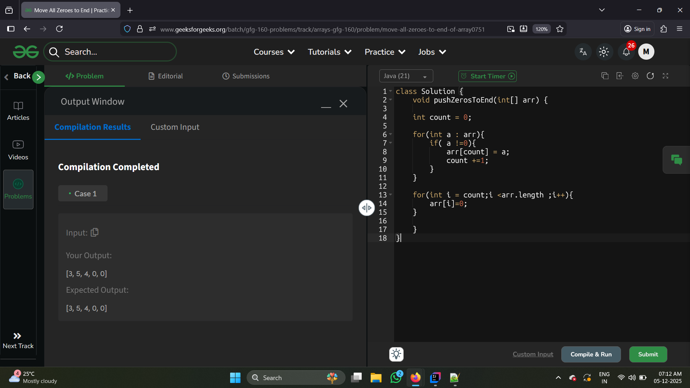
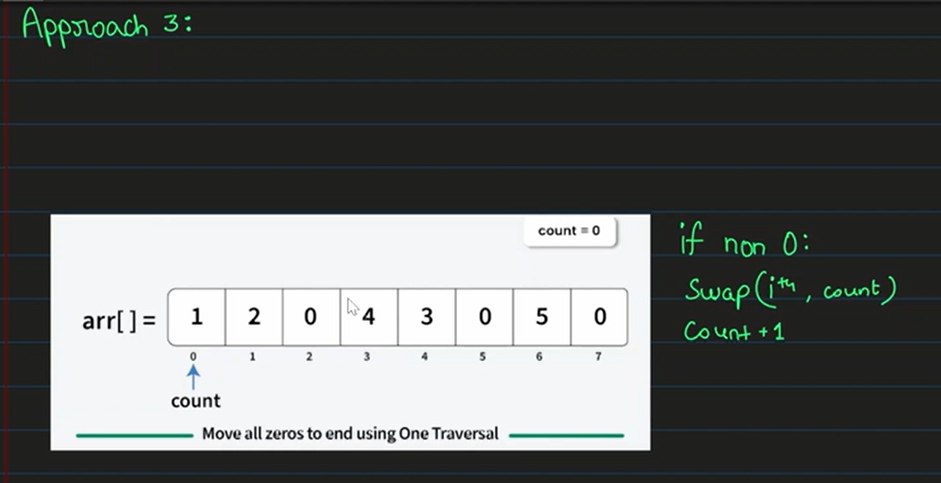
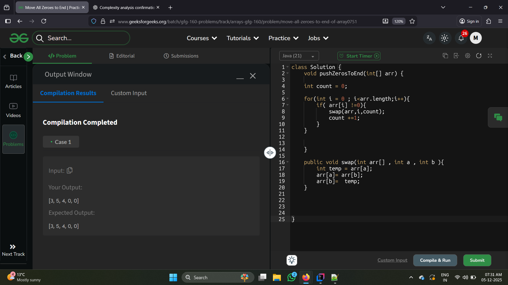

## 1. My Approach ( Brute Force )


- But in the problem statement they mention that dont use new array just use ( **in place** )

Complexity Analysis:
- T.C : O(n)
- S.C : O(n)
---

## 2.  Two Traversal 






Complexity Analysis :

- T.C : O(2n) => constant  removed so ( n )
- S.C : O(1)

## 3. One Traversal ( swap )






``` bash


```