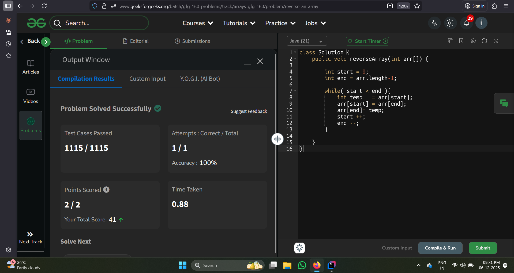

``` java
 public static void reverse_2(int arr []){


        int count = 0;
        int newArr [] = new int [arr.length];

        for(int i =arr.length-1;i>=0;i--){
            newArr[count] = arr[i];
            count ++;
        }

        System.out.println(Arrays.toString(newArr));
    }
```
Complexity Analysis

- T.C : O(n)
- S.C : 0(n)
---

## Using To pointers



```java
  public static void reverse_1(int arr []){

        int start =0;
        int end = arr.length-1;

        while(start < end){
            int temp = arr[start];
            arr[start]=arr[end];
            arr[end] = temp;

            start++;
            end--;
        }

        System.out.println(Arrays.toString(arr));
    }
```
Complexity Analysis

- T.C : O(n)
- S.C : 0(1)